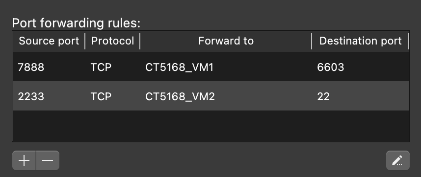

<h1> <div align="center"> CT5169 Fundamentals of Cloud Computing  </div> </h1>

<div align="center">  </div>

## Project Description
The goal of this assignment was to create a distributed cloud computing application. The main aspects are:
- A host machine which runs a Flask webserver. The website should provide a search bar which allows the user to search for Wikipedia results.
- Virtualization software is used (_Parallels Desktop Pro_) on the host machine to run a virtual machine (VM) running Ubuntu OS.
- The VM runs a MySQL database as a Docker container and exposes it on port 6603.
- The VM has a Python script, named _wiki.py_, which takes a query as an argument. It uses this query to search and parse Wikipedia pages for information relating to it. This is able to be executed from the host machine through SSH using Paramiko.
- The result is returned to the host machine and rendered neatly as HTML.
- If it is the first time a given query is run then the result is written to the MySQL database. If the same query is run at any other point it will pull the result from the database instead of following the full process of searching and parsing Wikipedia, which improves overall performance.


## Installation Instructions
### Setting up the Host Machine
The first step is to set up the host machine:
- Clone the repository using `$ git clone git@github.com:walsm232/CT5169-CA1.git`.
- Change directory to the repository, for example: `$ cd ~/Workspace/repos/CT5169-CA1`
- Install virtualenv if you don't have it already with `$ pip install virtualenv`.
- Create a new virtual environment named _venv_ with `$ virtualenv venv`.
- Activate the virtual environment using `$ source venv/bin/activate`.
- Install the project dependencies from the base directory with `$ pip install -r requirements.txt`.

From here, if you run the _main.py_ file it should start a local webserver at _http://127.0.0.1:8001_.


### Creating the Virtual Machine
The next step is to create our virtual machine (VM). To do this:
- Purchase and download _Parallels Desktop Pro for Mac_ from https://www.parallels.com/products/desktop/pro/
- Create a new VM using Ubuntu Linux as the operating system.
- You can name this VM however you like, I have used _CT5168_VM1_, though this should not particularly matter. Then start the VM.
- First we want to start by enabling SSH access to the VM. We can do this by opening a terminal and running:
```
$ sudo apt install openssh-server
$ sudo systemctl enable ssh --now
$ sudo ufw allow ssh
```
- Next we want to get Docker installed and run our MySQL container. We can do this with:
```
$ sudo apt install apt-transport-https curl gnupg-agent cacertificates software-properties-common –y
$ curl -fsSL https://download.docker.com/linux/ubuntu/gpg | sudo apt-key add -
$ sudo add-apt-repository "deb [arch=arm64] https://download.docker.com/linux/ubuntu $(lsb_release -cs) stable"
$ sudo apt install docker-ce docker-ce-cli containerd.io docker-buildx-plugin docker-compose-plugin -y
```
- Verify that the installation worked correctly by running `$ docker version`.
- To run our MySQL database we need to execute:
```
$ sudo docker pull mysql/mysql-server:latest
$ sudo docker run --name "mysqlcontainer1" -e MYSQL_ROOT_HOST=% -e MYSQL_ROOT_PASSWORD=mypassword -d -p 6603:3306 mysql/mysql-server:latest
```
- This command will deploy and run a new MySQL container named _mysqlcontainer1_. It will run the container in the background and allow connections from anywhere. The default password for the server will be set to _mypassword_. It asks the container to listen on port 6603 and forwards and connections to the MySQL server which is listening on port 3306.


### Setting Port-Forwarding Rules
Now we to set port-forwarding rules in order to open SSH access from the host to the VM and also to allow us to access the MySQL database from the host machine. We need to set the below rules in order for this to work correctly.

<div align="center">  </div>


### Creating the Database and Tables
The last step is to create a database and table for store our query results. We can do this by running the below commands on the VM:
```
$ sudo docker exec -it mysqlcontainer1 /bin/sh

sh-4.4# mysql -u root -p
Enter password:

>mysql CREATE DATABASE query_db;
>mysql USE query_db;

>mysql CREATE TABLE query_results (
   id int NOT NULL AUTO_INCREMENT PRIMARY KEY,
   query VARCHAR(255),
   result LONGTEXT
);
```

### Executing a Search Query
At this point you should be good to go. The last thing you should do is verify some of the parameters in the _main.py_ file such as _host, username, password, port, etc._ for the SSH functionality and the database connectivity. This is important as if they are not set correctly it will not work. If you type a query into the search bar you should see a result returned such as the one below. If you try to issue a query which you have already used you will notice a significant performance improvement as it is pulled straight from the database.

<div align="center">  </div>


## Built With
- Flask
- Python
- Docker
- MySQL
- HTML
- CSS
- jQuery
- FontAwesome

## Credits
**Developer:** Michael Walsh  
